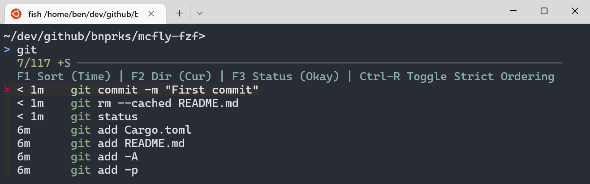

# McFly fzf integration
Integrate [McFly](https://github.com/cantino/mcfly) with [fzf](https://github.com/junegunn/fzf) to combine a solid command history database with a widely-loved fuzzy search UI

Features:

- sqlite-backed history database courtesy of McFly
- Rebinds `ctrl-r` to use an fzf-based interface
    - Supports [fzf search syntax](https://github.com/junegunn/fzf#search-syntax)
    - Inline layout options
- Toggle options in fzf interface:
    - F1: Sort by time vs neural network score
    - F2: Limit to commands run from current directory vs any directory
    - F3: Filter by exit status: Okay (zero), Fail (non-zero), Any



## Installation
1. Install mcfly: [Download binary](https://github.com/cantino/mcfly/releases), or view [other installation options](https://github.com/cantino/mcfly#installation)
2. Install fzf: [Download binary](https://github.com/junegunn/fzf/releases), or view [other installation options](https://github.com/junegunn/fzf#installation)
3. Install mcfly-fzf: (Currently requires Rust installation)  
    ```
    git clone https://github.com/bnprks/mcfly-fzf 
    cd mcfly-fzf 
    cargo install --path .
    ```

4. Add the following to the end of your `~/.bashrc`, `~/.zshrc`, or `~/.config/fish/config.fish` file:

    Bash:
    ```bash
    eval "$(mcfly init bash)"
    eval "$(mcfly-fzf init bash)"
    ```

    Zsh:
    ```bash
    eval "$(mcfly init zsh)"
    eval "$(mcfly-fzf init zsh)"
    ```

    Fish:
    ```bash
    mcfly init fish | source
    mcfly-fzf init fish | source
    ```

## Usage
- Press `ctrl-r` to open search:
    - Type to search
    - Arrow keys to navigate up/down
    - Enter to select
    - F1/F2/F3 to adjust view settings
- Respects the following environment variables
    - [`MCFLY_HISTORY_LIMIT`](https://github.com/cantino/mcfly#slow-startup)
    - [`MCFLY_RESULTS_SORT`](https://github.com/cantino/mcfly#results-sorting)
    - `FZF_DEFAULT_OPTS`, `FZF_CTRL_R_OPTS` (see [`man fzf`](https://www.mankier.com/1/fzf))
- To delete history entries, run `mcfly search` manually

## How it works
Overall:
- `mcfly-fzf` imports the `mcfly` crate to access the database.
- A per-session temporary json file stores the search setting toggles within and between searches.

What happens during `ctrl-r`:
1. `mcfly-fzf dump` reads the mcfly sqlite database and prints the entry to stdout, where it is piped to `fzf`
2. Toggling F1/F2/F3 in `fzf` runs `mcfly-fzf toggle`, which updates a temporary json file stored at `$MCFLY_FZF_OPTS`. Then `mcfly-fzf dump` runs again to re-populate the filtered results for `fzf`.
3. After selecting a history item, `mcfly-fzf select` marks the item in the `selected_commands` table so that the McFly neural network can prioritize frequently-selected items.

